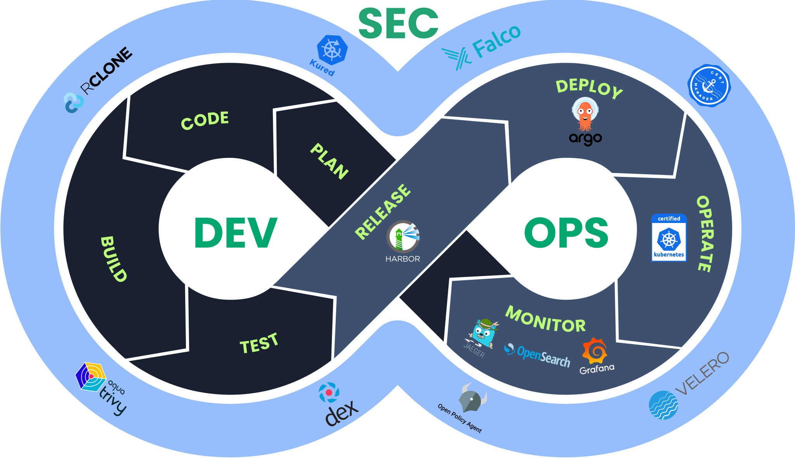

# Application Developer Overview

We know software developers are busy people that want to get up and running as soon as possible!

Use the navigational bar to the side to jump to the section that interests you the most.

## Orientation: The DevSecOps Loop

As an application platform, the main job of Welkin is to reduce your cognitive load.
The picture above helps you get a good grasp of how Welkin can support your everyday work.
It consists of a DevSecOps loop.
As you can see, Welkin integrates open-source projects, which help you do application Ops (operations) and application Sec (security).

Specifically:

- **Harbor**: Is a container registry.
You can use it to store container images produced by your Continuous Integration (CI) solution.
Welkin does not require a particular CI solution.
It facilitates security by having fine grained access control and built-in container image vulnerability scanning.
- **Argo CD (Additional Managed Service)**: Is a Continuous Delivery (CD) solution.
It helps you deploy your application -- usually represented by a Helm Chart -- into a Welkin environment.
Argo CD pulls changes from a Git repository, hence, it allows you practice GitOps, which improves security by reducing the number of people who need Kubernetes access.
- **Kubernetes**: Is the "engine" of the platform, the "spider in the net" if you will.
Welkin security-hardens Kubernetes, e.g., with restrictive access control, Pod Security Standards and OpenID authentication.
- **Grafana**: Allows you to observe application metrics.
It also hosts several dashboards which allow you to demonstrate compliance with common security controls.
- **OpenSearch**: Allows you to observe application and platform logs.
It is also home to platform audit logs, which allows you to determine who did what and when.
This improves security both by reducing incentives to act carelessly and by facilitating after-the-fact investigations.
- **Jaeger (Additional Managed Service)**: Allows you to observe application traces.
Jaeger can further simplify incident and performance management.
- **Falco**: Observes your application and alerts in case of behavior which is suspecious security-wise.
This improves security by watching for "unknown unknowns".
- **cert-manager**: Automates provisioning of TLS certificates.
This makes it easy for you to implement encryption-at-rest over untrusted networks.
- **Velero**: Handles backups and disaster recovery.
This enables the platform administrator to help you recover even from the worst incident.
- **Open Policy Agent**: Enforces guardrails to avoid trivial security mistakes, which may lead to compromising information confidentiality, integrity or availability.
Guardrails instill a culture of security by making it easier to use Welkin the right way.
- **Dex**: Integrates Welkin with your Identity Provider (IdP).
This improves security by making sure that each application developer accesses the platform with an individual account.
Said individual account makes its way into platform audit logs, which store who did what and when.
- **Trivy**: Scans containers for known security vulnerabilities.
This helps you deliver code which is free from vulnerabilities, which is an essential security requirement.
- **Rclone**: Copies the primary backup to a secondary backup infrastructure provider.
This improves resilience against ransomware attacks by making it harder for an attacker to compromise backups.
- **Kured**: Automates application of kernel and base Operating System (OS) patches.
This essentially it does automated vulnerability management "below" the container runtime.

## Getting started quickly

Welkin is a Kubernetes distribution that consists of the best (community-driven) open source components in the cloud native space, configured for security and platform stability.
It does not contain any proprietary technology, and no vendor-specific tooling, such as command-line tools or abstractions that only work in this distribution.
To the greatest extent possible, all technology contained within the distribution is community-driven open source, as in, not under a single vendor's control or governance.
The distribution is itself open source, and is also designed and developed in a transparent manner (see our [Architectural Decision Records](../adr/index.md)).



### Endpoint access



<!--
## Component overview

TODO https://github.com/elastisys/welkin/issues/836

-->

## Finding more information

If you are not familiar with Kubernetes since before, following our three-step process is a good idea, which includes a demo application for you to deploy and understand the entire process of containerizing an application and how to deploy it.

1. The [first step](prepare.md) is about making necessary preparations such as installing prerequisite software on your laptop.
1. The [second step](deploy.md) is about deploying your software.
1. The [third step](operate.md) is about how you continuously operate the software.

It may be a good idea to **follow along** in all of these, even if you have worked with similar systems before.

If you are familiar with similar systems, a common next step for Application Developers that are already used to Kubernetes is to read up on the [guardrails that Welkin ships with](safeguards/index.md).
You may also wish to use the "Go Deeper" link in the site's navigational bar to find more information about specific topics, such as:

- how to set up [log-based](log-based-alerts.md) or [metric-based](alerts.md) alerts,
- configure [long-term retention of logs](long-term-log-retention.md), or
- how to [use a user-friendly Kubernetes UI](kubernetes-ui.md) as an alternative or complement to the `kubectl` command line tool.
