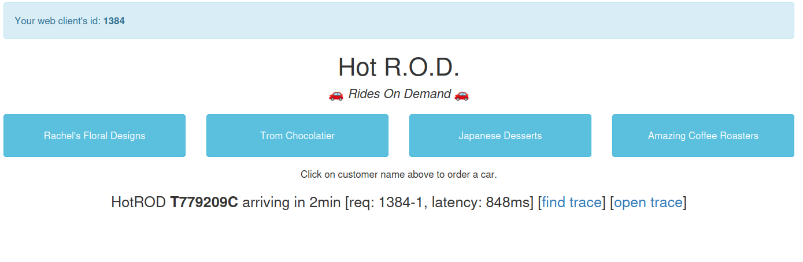
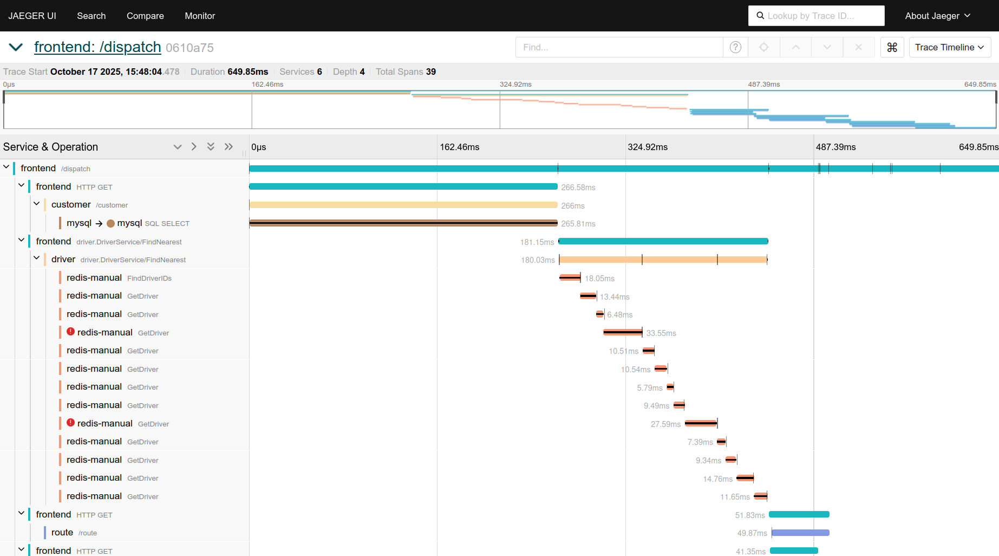
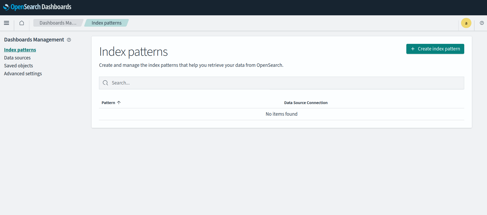
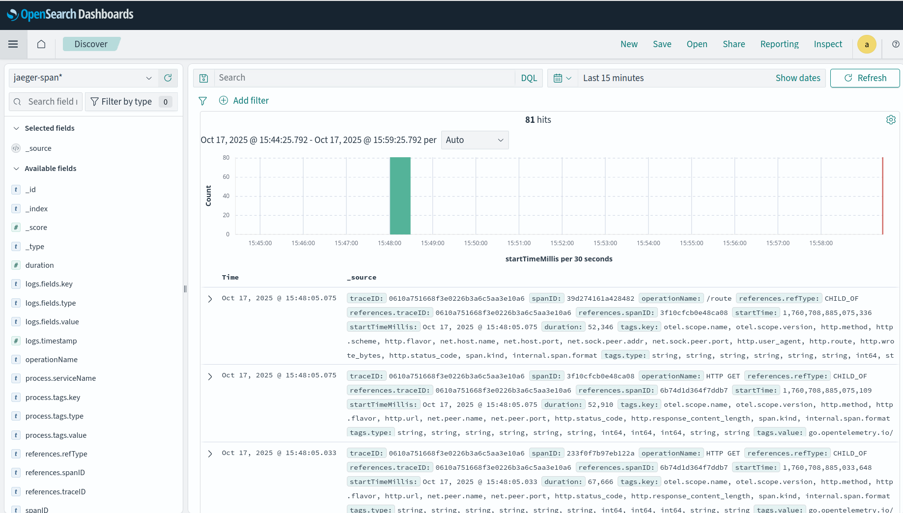

---
search:
  boost: 2
---
# Jaeger (self-managed)





> [!IMPORTANT]
> This feature is only available on Welkin Apps versions `v0.50.0` and newer.

This page will help you install [Jaeger](https://www.jaegertracing.io/) with [OpenSearch](https://opensearch.org/) as a storage backend, and generate some traces to verify that everything is working. This guide is meant as a complement to the official documentation of the [Jaeger Operator](https://github.com/jaegertracing/helm-charts/tree/jaeger-operator-2.57.0/charts/jaeger-operator), [OpenSearch](https://github.com/opensearch-project/helm-charts/tree/opensearch-2.34.0/charts/opensearch) and [OpenSearch Dashboards](https://github.com/opensearch-project/helm-charts/tree/opensearch-dashboards-2.30.0/charts/opensearch-dashboards), which you can refer to for further configuration based on your needs.

## Enable Self-Managed Jaeger

Following the guide requires the [self-managed Cluster resources](../../operator-manual/user-managed-crds.md) feature to be enabled. You can contact your Platform Administrator to have this feature enabled.

## Deploy

This section will guide you through deploying all components with a minimal working configuration. Everything must be deployed in a namespace called `jaeger`. You can create this namespace under your parent namespace using the following snippet:

```bash
kubectl apply -f - <<EOF
apiVersion: hnc.x-k8s.io/v1alpha2
kind: SubnamespaceAnchor
metadata:
  name: jaeger
  namespace: <parent-namespace>
EOF
```

### Configure and Deploy OpenSearch

!!! Note "Supported versions"

    This installation guide has been tested with OpenSearch version [2.34.0](https://github.com/opensearch-project/helm-charts/tree/opensearch-2.34.0/charts/opensearch).

Start by generating a strong password that will be used as the initial admin password for OpenSearch. The password needs to be a minimum of 8 characters long and must contain at least one uppercase letter, one lowercase letter, one digit, and one special character that is strong.

Then create a Secret containing this password:

```bash
kubectl apply -f - <<EOF
apiVersion: v1
kind: Secret
metadata:
  name: opensearch-credentials
  namespace: jaeger
type: Opaque
stringData:
  ES_PASSWORD: <your-strong-password>
  ES_USERNAME: admin
EOF
```

Add the OpenSearch Helm repository:

```bash
helm repo add opensearch https://opensearch-project.github.io/helm-charts/
helm repo update
```

Below is a sample `opensearch-values.yaml` file for OpenSearch that you can save to your working directory:

```yaml
config:
  opensearch.yml: |-
    network.host: 0.0.0.0
    action:
      auto_create_index: "jaeger*,.opensearch*,.opendistro-*,security-auditlog-*"
persistence:
  enableInitChown: false
resources:
  requests:
    cpu: 500m
    memory: 1Gi
persistence:
  imageTag: stable
  enableInitChown: false
extraEnvs:
  - name: OPENSEARCH_INITIAL_ADMIN_PASSWORD
    valueFrom:
      secretKeyRef:
        name: opensearch-credentials
        key: ES_PASSWORD
  - name: plugins.security.ssl.http.enabled
    value: "false"
  - name: plugins.security.allow_default_init_securityindex
    value: "true"
```

Once you are happy with the configuration, you are ready to deploy OpenSearch:

```bash
helm upgrade --install opensearch opensearch/opensearch --version 2.34.0 \
  -n jaeger \
  -f opensearch-values.yaml
```

### Configure and Deploy OpenSearch Dashboards

!!! Note "Supported versions"

    This installation guide has been tested with OpenSearch Dashboards version [2.30.0](https://github.com/opensearch-project/helm-charts/tree/opensearch-dashboards-2.30.0/charts/opensearch-dashboards).

Once OpenSearch is up and running, you are ready to deploy OpenSearch Dashboards. Below is a sample `opensearch-dashboards-values.yaml`:

```yaml
opensearchHosts: "http://opensearch-cluster-master.jaeger.svc.cluster.local:9200"
resources:
  requests:
    cpu: 200m
    memory: 300Mi
  limits:
    cpu: 400m
    memory: 600Mi
rbac:
  create: false
```

Deploy OpenSearch Dashboards:

```bash
helm upgrade --install opensearch-dashboards opensearch/opensearch-dashboards \
   --version 2.30.0 \
  -n jaeger \
  -f opensearch-dashboards-values.yaml
```

### Configure and Deploy Jaeger Operator

!!! Note "Supported versions"

    This installation guide has been tested with Jaeger Operator version [2.57.0](https://github.com/jaegertracing/helm-charts/tree/jaeger-operator-2.57.0/charts/jaeger-operator).

Start by adding the Jaeger Helm repository:

```bash
helm repo add jaegertracing https://jaegertracing.github.io/helm-charts
helm repo update
```

Below is a sample `jaeger-operator-values.yaml`:

```yaml
extraEnv:
  - name: WATCH_NAMESPACE
    value: "jaeger"
  - name: ES_TAGS_AS_FIELDS_ALL
    value: "true"
webhooks:
  mutatingWebhook:
    create: false
  validatingWebhook:
    create: false
rbac:
  create: false
  clusterRole: false
serviceAccount:
  name: jaeger-operator
resources:
  requests:
    cpu: 100m
    memory: 128Mi
  limits:
    cpu: 250m
    memory: 256Mi
jaeger:
  create: true
  spec:
    ingress:
      enabled: false
    strategy: production
    collector:
      resources:
        requests:
          cpu: 100m
          memory: 200Mi
        limits:
          cpu: 500m
          memory: 512Mi
    agent:
      resources:
        requests:
          cpu: 100m
          memory: 200Mi
        limits:
          cpu: 500m
          memory: 512Mi
    query:
      resources:
        requests:
          cpu: 100m
          memory: 200Mi
        limits:
          cpu: 500m
          memory: 512Mi
    storage:
      dependencies:
        enabled: false
      type: elasticsearch
      secretName: opensearch-credentials
      options:
        es:
          create-index-templates: false
          server-urls: http://opensearch-cluster-master:9200
        es-provision: false
      esIndexCleaner:
        enabled: false
```

Install the Jaeger Operator:

```bash
helm upgrade --install jaeger-operator jaegertracing/jaeger-operator \
--version 2.57.0 \
-n jaeger \
-f jaeger-operator-values.yaml
```

## Example Application

Once you have deployed everything, you likely want to test that everything is working, and in order to do so you will want to generates some traces. This section will guide you through deploying a demo application to generate some traces, as well as viewing them in OpenSearch Dashboards and the Jaeger UI. Jaeger provides a [demo microservice application](https://github.com/jaegertracing/jaeger/blob/main/examples/hotrod/README.md) which we will be using. The snippet below can be used to deploy the demo application:

```bash
kubectl apply -f - <<EOF
apiVersion: apps/v1
kind: Deployment
metadata:
  name: hotrod
  namespace: jaeger
spec:
  replicas: 1
  selector:
    matchLabels:
      app: hotrod
  template:
    metadata:
      labels:
        app: hotrod
    spec:
      containers:
        - name: hotrod
          image: jaegertracing/example-hotrod:1.53
          env:
            - name: OTEL_EXPORTER_OTLP_ENDPOINT
              value: "http://jaeger-operator-jaeger-collector.jaeger.svc.cluster.local:4318"
          args:
            - "all"
          ports:
            - containerPort: 8080
          resources:
            requests:
              cpu: "100m"
              memory: "128Mi"
            limits:
              cpu: "250m"
              memory: "256Mi"
          securityContext:
            runAsUser: 1000
---
apiVersion: v1
kind: Service
metadata:
  name: hotrod-svc
  namespace: jaeger
spec:
  selector:
    app: hotrod
  type: ClusterIP
  ports:
    - name: http-hotrod
      port: 8080
      targetPort: 8080
EOF
```

Once the demo application is up and running, you can start forwarding a local port to it:

```bash
kubectl port-forward -n jaeger svc/hotrod-svc 8080:8080
```

Also forward a local port to the Jaeger UI in a separate terminal:

```bash
kubectl port-forward -n jaeger svc/jaeger-operator-jaeger-query 16686:16686
```

You can now navigate to the demo application UI in your browser at `http://localhost:8080/`, where you can click on the different buttons to generate traces. See the screenshot below:



When generating a trace, the UI will output a `open trace` link which will take you to the trace in the Jaeger UI, where you can view details about it. See the screenshot below:



Afterwards you can close the port-forwards to the demo application and the Jaeger UI.

Now that there have been traces generated, you can also view them in OpenSearch Dashboards. To do so forward a local port to the OpenSearch Dashboards Pod:

```bash
kubectl port-forward -n jaeger svc/opensearch-dashboards 5601:5601
```

Go to OpenSearch Dashboards in your browser by visiting `http://localhost:5601`. You can log in with the `admin` user and the password you generated earlier, which is available in the `opensearch-credentials` secret:

```bash
kubectl get secret -n jaeger opensearch-credentials -o jsonpath='{.data.ES_PASSWORD}' | base64 -d
```

Once you have logged in, navigate to `Dashboards Management->Index patterns` and create the index patterns `jaeger-service*` and `jaeger-span*`. See the screenshot below:



Afterwards, you can go to the `Discover` page and select the `jaeger-span*` index pattern to view the traces. See the screenshot below:



When you have finished testing things out, you can remove the demo application:

```bash
kubectl delete deployment -n jaeger hotrod
kubectl delete service -n jaeger hotrod-svc
```

## Further Reading

- [OpenSearch Documentation](https://docs.opensearch.org/2.19/about/)
    - [Configuring OpenSearch Security](https://docs.opensearch.org/2.19/security/configuration/index/)
    - [Best Practices](https://docs.opensearch.org/2.19/security/configuration/best-practices/)
    - [OpenSearch Index State Management](https://docs.opensearch.org/2.19/im-plugin/ism/index/)
- [Jaeger Operator Documentation](https://www.jaegertracing.io/docs/1.74/deployment/operator/)
